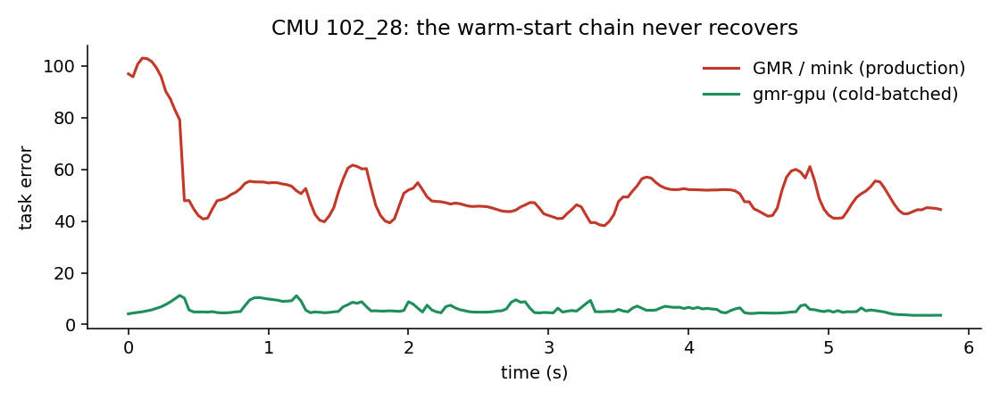

https://github.com/user-attachments/assets/b2e1283f-b649-414a-9d18-4f7e49044cad

# gmr-gpu

**Batched, differentiable GPU motion retargeting for humanoid robots** — a GPU
backend for [GMR](https://github.com/YanjieZe/GMR) that solves the *same*
retargeting problem (same IK configs, weights, and preprocessing, validated to
machine precision) as a batched projected Levenberg-Marquardt iteration in pure
PyTorch.

<!-- VIDEO PLACEHOLDER: hero — side-by-side (gmr-gpu | GMR/mink), same clip,
     "spot the difference" framing -->

## Headline: all of CMU, one laptop

1,983 clips · 977,581 frames · 9.05 hours of motion. RTX 4090 Laptop GPU,
WSL2, 15 GiB RAM. Quality = weighted task error against identical targets,
same metric for every method (lower is better).

| method | clips | frames | solve time | fps | task err mean / p95 |
|---|---|---|---|---|---|
| **gmr-gpu (cold-batched)** | **1,983 (100%)** | 977,581 | **25.6 min** | **637** | **6.18 / 8.01** |
| GMR / mink (solve-only, same cached inputs) | 1,983 | 977,581 | 42.2 min | 386 | 7.28 / 9.02 |
| GMR production script (end-to-end) | 1,379 (69.5%) | 541,881 | 195 min | 46 | 7.48 / 9.34 |

- **Better tracking, not just faster**: at production iteration budgets the
  batched solver converges deeper per frame — 15% lower task error across the
  entire dataset. Converged optima match mink's (proven on shared clips); the
  win is budget economics, purchased by batching.
- **21× real-time** end-of-pipe: 9 hours of human motion retargeted in 25.6
  minutes of GPU solving.
- **100% coverage**: memory-bounded chunked preprocessing handles every clip,
  including the long ones whose full-clip SMPL-X forward (up to ~50 GB) OOM-kills
  the production pipeline. The production script tops out near 70% on a 15 GiB
  machine.
- The repo/mink error difference is subset composition only — their
  trajectories are provably identical (max joint difference 3e-7); the
  production script simply never finishes 604 clips.
- A warm-started sequential mode (the CPU solver's structure, batched) is
  dominated by construction: the frame-to-frame dependency chain caps wall time
  at longest-clip × per-step regardless of batch width, and warm starts inherit
  bad basins on acrobatic clips. Cold-start with each frame's base initialized
  at its own pelvis target wins on both axes — one of several findings in
  [`docs/journey/`](docs/journey/).
- Fair-accounting note: solve-only rows share a one-time, resumable
  preprocessing cache (SMPL-X forward + SLERP, robot-agnostic, reusable across
  robots and solver runs); the production script's row includes that work
  inline, which is exactly what makes it the end-to-end baseline.

## When the production pipeline fails

Dataset-wide means hide the sharpest difference. Comparing per-clip tracking
error across all 1,983 clips:

|  | clips >2× worse than the other | worst case |
|---|---|---|
| GMR / mink | **61 clips (3.1%)** | 16× (task error 124 — not tracking) |
| gmr-gpu | 2 clips (0.1%) | 2.6× |

The mechanism is structural, not a tuning issue. The production solver is a
sequential warm-start chain: frame *t* starts from frame *t−1*'s solution with
a tight iteration budget. When frame 0's target is far from the standing init,
the solver never reaches it — and then **every subsequent frame inherits the
lost pose**. The chain locks the failure in for the whole clip:



gmr-gpu has no chain to derail: every frame is solved independently with its
base initialized at its own pelvis target. Same IK problem, same weights —
immunity by architecture.

<!-- VIDEO PLACEHOLDER: featured failure pair — hero_102_28 (mink error 51.7
     vs ours 5.9) and hero_94_01 (38.6 vs 7.8), side-by-side renders where the
     production pipeline visibly fails and gmr-gpu tracks -->

Honesty note: the 2 clips where we are worse (74_09, 84_09 — short 49-frame
stubs, plateaued at ~2.5× in a wrong joint-fold basin) are the residual
cold-start cost. A flag-and-repair pass (re-solve high-error outliers warm) is
straightforward future work; the reverse fix for the chain's 61 does not exist
inside a sequential architecture.

<!-- VIDEO PLACEHOLDER: gallery — remaining clips, 3-pane (cold | seq | mink)
     follow-cam renders across CMU subjects -->

## Why differentiable

The kinematics and solver are pure functional torch: no in-place writes, no
TorchScript, no data-dependent branches. Beyond speed, that means you can
backprop *through* retargeting — learn IK weights, embed retargeting in a
training loop, or feed an RL pipeline without the motion ever leaving the GPU.

## Quickstart

```python
from gmr_gpu import retarget_clips

motions = retarget_clips(["path/to/clip_stageii.npz"], robot="unitree_g1")
# motions[0] = {"fps", "root_pos" (T,3), "root_rot" (T,4 xyzw), "dof_pos" (T,29)}
```

Requires the SMPL-X body models (registration required, not redistributable) in
`$SMPLX_FOLDER` or GMR's `assets/body_models/` — same convention as GMR.

## How it works

- Pure-functional batched kinematics (`BatchedRobot`), geometry from the
  compiled MuJoCo model; SE(3) body-twist error matching mink's convention.
- `vmap(jacrev)` task Jacobians; batched Cholesky normal equations with
  per-item Levenberg-Marquardt damping; joint limits as exact box projection;
  branchless accept/reject masks.
- Every frame of every clip is an independent problem, pooled into GPU batches
  of 8192; each frame's floating base initializes at its own pelvis target.

## Validation

Every layer is certified against an independent oracle (`tests/`, `pytest`):
forward kinematics vs MuJoCo (1e-15), twist error vs mink (1e-15), Jacobians
triangulated against finite differences *and* mink's analytic Jacobian,
batched-vs-sequential equivalence (1e-14), and full-dataset output parity vs
the GMR/mink production pipeline on real CMU data. The build-and-certify
journey — including every wrong turn — is preserved in
[`docs/journey/`](docs/journey/).

## License

MIT. Builds on [GMR](https://github.com/YanjieZe/GMR) (MIT) by Yanjie Ze et al.
CMU mocap via [AMASS](https://amass.is.tue.mpg.de/) (not redistributed here).
